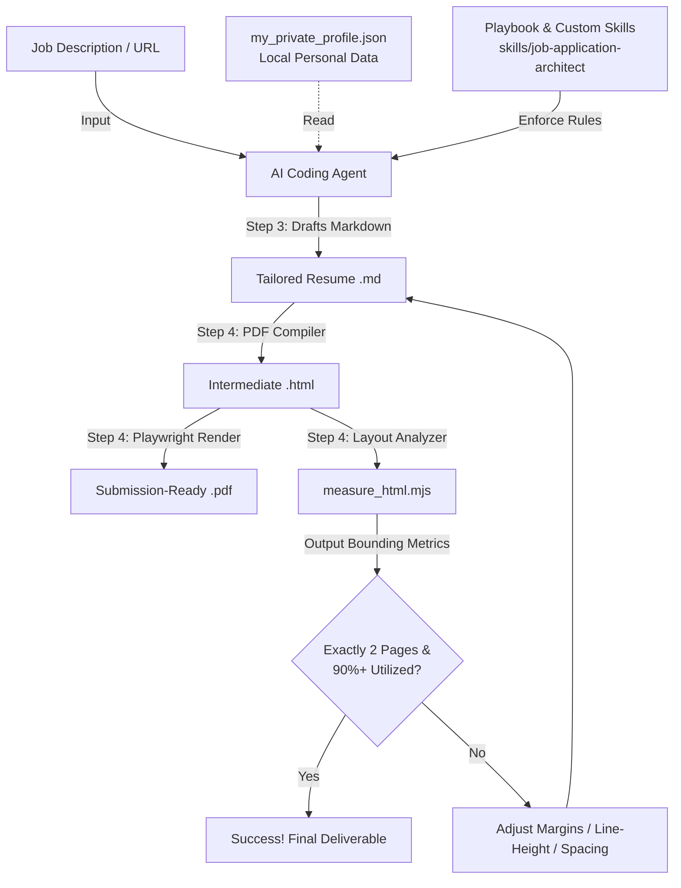

# 🛠️ Job Application Architect & Auto-Layout Engine

A premium, configuration-driven job application automation workspace. This system enables high-fidelity, custom resume and cover letter tailoring aligned with strict page-budget layouts, utilizing a **Separation of Concerns (SoC)** architecture. 

It keeps the workspace 100% clean and public-repository ready by separating private personal data from generic rendering logic and custom AI agent skills.

---

## 🌟 Core Features

- **⚙️ Data & Logic Separation**: All private personal contact information, certifications, exact degrees, and career anchors reside in a local `my_private_profile.json` (completely git-ignored). The repository remains entirely generic and public-safe.
- **🤖 Embedded AI Agent Skills**: Custom AI agent skills (`skills/job-application-architect/SKILL.md`, `resume-writer`, `cover-letter-writer`) are placed directly in the workspace. Any LLM agent entering this directory inherits these instructions and operates as a step-by-step professional resume coach.
- **📄 Pixel-Perfect Auto-Layout Renderer**: Powered by a custom Node.js and Playwright engine (`_archive/New_project_.../scripts/`), the workspace compiles Markdown resumes directly to DOCX, HTML, and beautifully formatted PDFs.
- **📏 Strict Page-Budget Verification**: Includes a layout measurement tool that programmatically calculates page breaks and scroll heights, enforcing strict PDF constraints (e.g., exactly 2 pages with 90%+ vertical page coverage and zero awkward trailing text).

---

## 📂 Directory Structure

```text
├── skills/
│   ├── job-application-architect/
│   │   └── SKILL.md                 # 5-step guided interactive tailoring workflow
│   ├── resume-writer/
│   │   └── SKILL.md                 # Config-driven resume tailoring instructions
│   └── cover-letter-writer/
│       └── SKILL.md                 # Concise cover letter generator rules
├── _archive/
│   └── New_project_2026-05-20_171444/
│       └── scripts/
│           ├── render_resume_pdf.mjs  # Markdown-to-PDF/HTML compiler (Playwright)
│           ├── render_resume_docx.mjs # Markdown-to-DOCX compiler
│           └── measure_html.mjs      # Programmatic height & page-break analyzer
├── Job_Application_Playbook_Annie_Gao.md # Central guidelines for resume & essays
├── my_private_profile.json          # [Git-Ignored] Local private profile & data
├── outputs/                         # [Git-Ignored] Generated PDF/DOCX resumes & cover letters
└── .gitignore                       # Ensures zero credentials leak to GitHub
```

---

## 🛠️ How it Works (System Architecture)



---

## 🚀 Quick Start Guide

### 1. Initialize Your Local Private Profile
Create a `my_private_profile.json` file in the root directory. Follow this schema:
```json
{
  "personal_info": {
    "full_name": "Your Name",
    "email": "your.email@example.com",
    "phone": "+1 123-456-7890",
    "linkedin": "linkedin.com/in/yourprofile",
    "credentials_suffix": "PMP · CSM · M.Ed"
  },
  "education": [
    {
      "degree": "Degree Name",
      "institution": "University Name",
      "graduation_date": "Date"
    }
  ],
  "certifications": [
    "Certification 1",
    "Certification 2"
  ],
  "career_anchors": {
    "company_a": {
      "title": "Your Title",
      "location": "Location",
      "period": "Start - End"
    }
  },
  "restricted_keywords": {
    "remove": ["SQL", "Tableau"],
    "use_instead": {}
  },
  "skills_customization": {
    "ai_skills": ["Claude", "ChatGPT"]
  }
}
```
*(Note: Because this file is listed in `.gitignore`, it will remain completely local and safe on your machine.)*

### 2. Trigger the AI Tailoring Agent
When starting a new chat session in this workspace, kick off the workflow by typing:
> **"Help me customize my application documents for this new position. Use our custom `skills/job-application-architect` workflow to guide me step-by-step."**

### 3. Compile Resumes to PDF
Once the Markdown resume is approved in chat, compile it locally:
```bash
# Render to PDF and intermediate HTML
node _archive/New_project_2026-05-20_171444/scripts/render_resume_pdf.mjs outputs/resumes/your_resume.md outputs/resumes/your_resume.pdf
```

### 4. Verify Bounding Metrics & Page Counts
Run the HTML analyzer to measure scroll heights and verify it meets exact layout budgets:
```bash
node _archive/New_project_2026-05-20_171444/scripts/measure_html.mjs outputs/resumes/your_resume.html
```

---

## 🔒 Security & Privacy Guardrails
The workspace uses robust `.gitignore` rules to shield all personal contact cards, private job experiences, and custom output folders. Feel free to fork, customize, and publish the code architecture as an impressive technical portfolio project!
